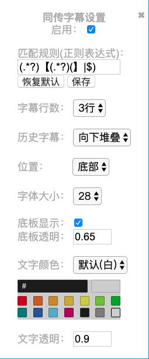
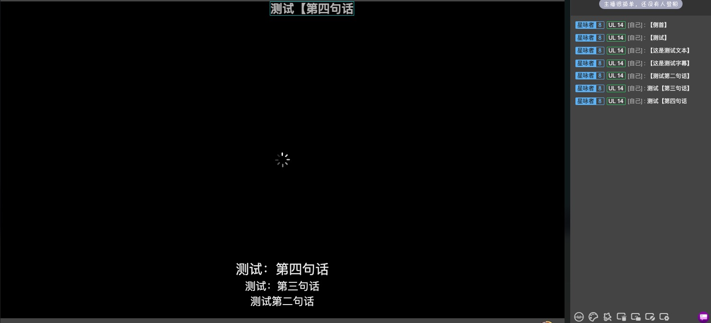
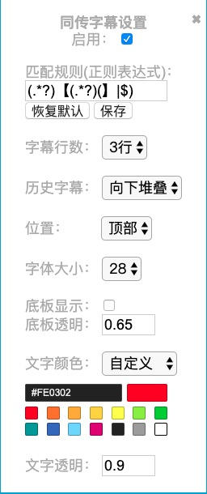

# VtuberSubtitle
## 简介
油猴脚本的B站同传弹幕过滤，并以类似于CSS字幕的方式显示。  
CSS样式是抄的B站CC字幕的，黑色背板可开可关有透明度，功能目前就如图这么多，也够简单使用的了。
这也算是最早整的油猴，之前也没弄过，js也没系统学过，代码框架是用的网上找的 [Bilibili上下弹幕变字幕](https://greasyfork.org/zh-CN/scripts/35205-bilibili%E4%B8%8A%E4%B8%8B%E5%BC%B9%E5%B9%95%E5%8F%98%E5%AD%97%E5%B9%95)。  
没用API，用的是原始的html办法，读取弹幕栏。  
因为雏形已经弄好了有一段时间，最近把设置功能完善了一下干脆发出来好了。  
## 安装
**[greasyfork](https://greasyfork.org/zh-CN/scripts/402286-bilibili%E5%90%8C%E4%BC%A0man%E5%BC%B9%E5%B9%95%E5%AD%97%E5%B9%95%E6%98%BE%E7%A4%BA)**    
安装油猴插件后 [一键安装](https://greasyfork.org/scripts/402286-bilibili%E5%90%8C%E4%BC%A0man%E5%BC%B9%E5%B9%95%E5%AD%97%E5%B9%95%E6%98%BE%E7%A4%BA/code/bilibili%E5%90%8C%E4%BC%A0man%E5%BC%B9%E5%B9%95%E5%AD%97%E5%B9%95%E6%98%BE%E7%A4%BA.user.js)  

  

### [我的B站](https://space.bilibili.com/13525042)  
### [我的博客](http://www.wetor.top)
